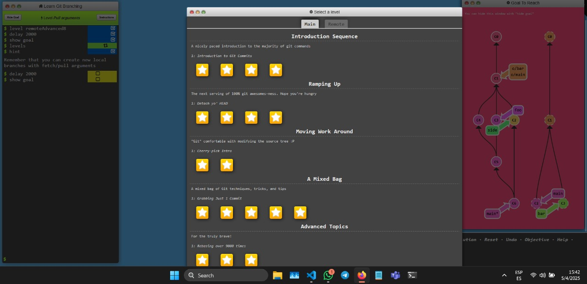
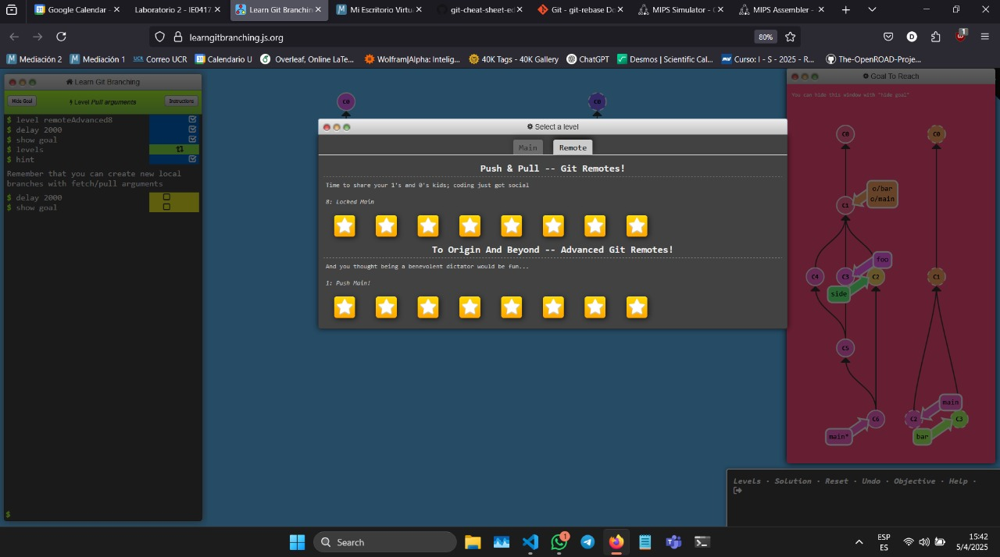
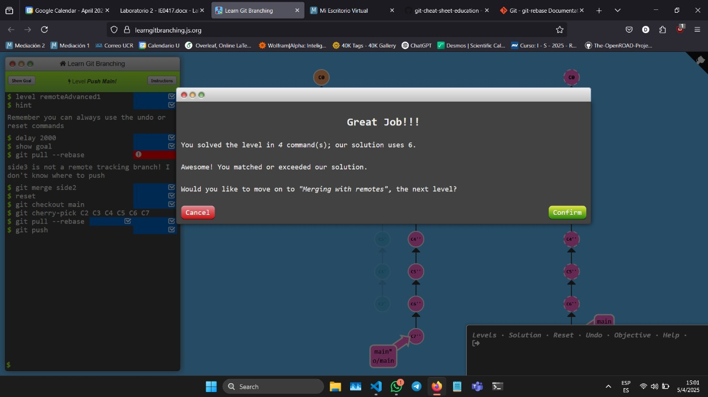

# Laboratorio 2

## Parte 1 – Git y control de versiones

Se realizaron todas las pruebas disponibles en la plataforma [Learn Git Branching](https://learngitbranching.js.org/), completando los 34 niveles (niveles avanzados incluidos) en una misma sesión. A través del proceso se logró aprender de las diversas herramientas utilizadas en el proceso de control de versiones con Git. Durante las pruebas se tuvo que repetir varios niveles para conseguir la finalidad  de los mismos con la cantidad de comandos designados por la plataforma. Se logró esto para todos los niveles (denotado por la estrella marcada en cada uno).

Incluso se logró finalizar algunos niveles de forma más eficiente (menos comandos), que los planteados.

## Parte 2 – Documentación automática en C++ y Python

### Documentación de proyecto en C++ con Doxygen

Para realizar la documentación automática con Doxygen se utiliza una de las tareas realizadas ([Tarea 3](https://github.com/DiegoAlfaroUCR/ie0217/tree/main/Tareas/TAREA_TRES)) en el repositorio del curso [IE0217 - Estructuras Abstractas de Datos y Algoritmos para Ingeniería](https://github.com/DiegoAlfaroUCR/ie0217). En esta tarea se crearon 2 programas en C++, uno para operaciones básicas con matrices de números reales e imaginarios y otro para la verificación de correos electrónicos válidos con regex. Estos ya poseen la documentación en el formato usado para Doxygen en los headers de cada clase (los archivos .hpp). Todo el código fuente se encuentra en el directorio [`src`](https://github.com/DiegoAlfaroUCR/ie0217/tree/main/Tareas/TAREA_TRES/src) de la tarea.

#### Generación de la documentación

Para generar la documentación se crea un directorio `docs` para guardar el html generado y se siguen las instrucciones de la [documentación oficial de Doxygen](https://www.doxygen.nl/manual/starting.html). Se genera un archivo de configuración con el comando `doxygen -g <config-file>` de nombre config en `docs`. En este se editan las siguientes configuraciones:

- PROJECT_NAME           = "Tarea 3"
- PROJECT_BRIEF          = "Tarea 3 de curso IE-0217" 
- OUTPUT_LANGUAGE        = Spanish
- JAVADOC_AUTOBRIEF      = YES
- JAVADOC_BANNER         = YES
- EXTRACT_ALL            = YES
- EXTRACT_PRIVATE        = YES
- GENERATE_LATEX         = NO
- STRIP_FROM_PATH        = ../
- INPUT                  = Tareas/TAREA_TRES/src
- OUTPUT_DIRECTORY       = docs
- INCLUDE_FILE_PATTERNS = *.hpp *.cpp
- FULL_PATH_NAMES = NO
- SOURCE_BROWSER = YES

La mayoría de estas se modificaron según necesidades como el lenguaje, los javadoc autobrief/banner por el estilo de documentación, la opción para no generar documentación en LaTeX y el directorio con el código fuente. Otras son por preferencias en la presentación como la de recortar los filepath a solo los relativos evitando que se genere con el filepath del usuario y los nombres/brief del proyecto. 

Una vez se tiene el archivo de configuración listo, se usa el comando `doxygen <config-file>` para generar la documentación. Para visualizarla se abre el archivo `index.html` localizado en el directorio `html` generado. Se colocó una copia del archivo de configuración editado y el html generado en el directorio `docs/doxygen`.

#### Sitio para alojar la documentación
Se investigó y eligió utilizar Github Pages para alojar la página estática generada con Doxygen. La razón principal por la cual se escogió Github Pages como la plataforma es debido a que ya se posee todo el código en un repositorio hosteado en Github. Siguiendo la guía de Github para hostear la página por medio de un branch, se creó un branch `docs/tarea3` donde se guardó una copia de los contenidos del html en un directorio `docs` en la raíz del repositorio. Al escoger "/docs" como fuente de los contenidos de la página, se obtuvo el siguiente link a la página con la documentación correctamente mostrada: https://diegoalfaroucr.github.io/ie0217/.

### Documentación de proyecto en Python con Sphinx

Para realizar una documentación con Sphinx primero se requiere un código con documentación apropiada. Debido a que no se tenían proyectos pasados con documentación ya hecha, se decidió generar un script con Gemini según requerimientos/especificaciones diseñadas. Siguiendo interés en los temas del curso de Estructuras de Computadores, se describió un simulador de MIPS el cual fuera capaz de leer un archivo de assembly (específicamente las instrucciones que corresponden a MIPS), simular sus funciones y mostrar el resultado final de los valores guardados en memoria. Se definieron límites de posiciones de memoria, instrucciones máximas y se hizo revisión de errores para poder reducir el ámbito del simulador. Incluido en los requisitos de los prompts se especificó la necesidad de documentación compatible con Sphinx en español. Se aloja este código en el repositorio [MIPSsimulator](https://github.com/DiegoAlfaroUCR/MIPSsimulator), el cual se utilizará para generar la página de la documentación.

Pasos realizados para generar la documentación con la [guía Sphinx](https://www.sphinx-doc.org/en/master/tutorial/index.html). En la carpeta `docs/sphinx/html` se corre el comando `sphinx-quickstart`, con las opciones correspondientes de nombre de proyecto/autor y separando los directorios de source y output. Luego, se modifica el archivo `conf.py`, agregando el path al archivo con el código (en este caso devolviéndose al directorio sphinx con "../../") y las extensiones necesarias para autodoc/napoleon. Además se agrega la información del archivo MIPSsimulador con un archivo .rst en `source` y se edita el `index.rst` para referenciar dicho archivo. Finalmente desde el directorio `html` se utiliza el makefile con la tarea html (`make html` en GNU make o `mingw32-make html` en windows) para generar el html de la página con la documentación. Esta se genera en el directorio `build` creado por Sphinx y se puede visualizar a partir del `index.html`. Finalmente, se cambia el tema del html generado en el archivo conf.py (html_theme = 'sphinx_rtd_theme') al de `sphinx_rtd_theme`, el cual se instala por medio del administrador de paquetes de Linux (WSL).

#### Sitio para alojar la documentación

Para alojar la documentación generada se escogió utilizar Read the Docs, debido a que está especializada para documentación generada con Sphinx. Para utilizar la plataforma, se creó una cuenta vinculada a la cuenta de Github y se siguieron las instrucciones de la página de [Read the Docs](https://about.readthedocs.com/) para configurar el repositorio dedicado al código. Se agregó el archivo `.readthedocs.yaml` al root del repositorio, modificándolo para ubicar el archivo `config.py`. Además, debido a que se utilizó un tema distinto, fue necesario agregar un `requirements.txt` en `docs` especificando el tema utilizado para que la build fuera exitosa. Una vez se ha configurado el repositorio, se hace el deployment por medio de la sección de builds de Read the docs. La build con el commit más reciente está hosteada en: https://mipssimulator.readthedocs.io/es/latest/